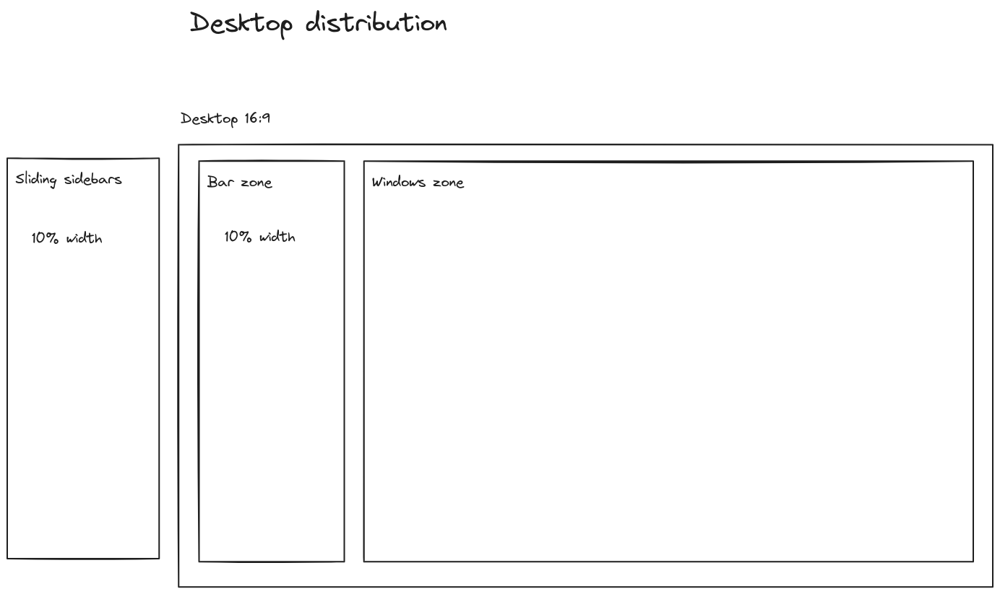

# Hyprland Prototype 001

This is a eww config aiming at my new hyprland rice where I experiment with a status bar on the left that also ocuppies like 10% width and has a bunch of big widgets visible all the time.

---

## TODO

- [ ] Write a README
- [ ] Fill the first 6 steps of the TODO section
- [ ] Define minimal list of widgets to write
- [ ] Define minimal list of Sidebars
- [ ] Widget: Music
- [ ] Widget: Quicklaunch bar with 6 icons
- [ ] Sidebar: wallpaper changer
- [ ] 
